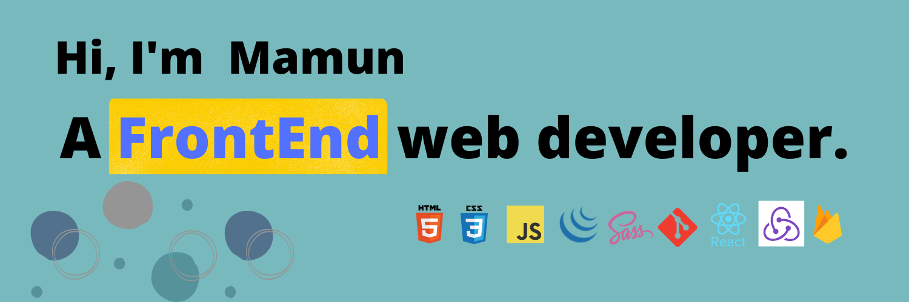

- 🖥️ My recent project: [Project manager][project]!
- 👷 I'm currently working on a [Productivity + project management site.](https://sociallig.netlify.app)
- 🏫 I'm looking for jobs and doing side projects.
- 🥅 2022 Goals: Learning useful technology that I don't know.
- ⚡ Fun fact: I love programming.

### Connect with me:

[][website]
[][twitter]

 

### Languages and Tools:

[][website]
[][website]
[][website]
[][website]
[][website]
[][website]
[][website]
[][website]
[][website]
[][website]
[][website]
[][website]

[website]: https://devmdmamun.com
[project]: https://proligz.web.app/
[twitter]: https://twitter.com/devmdmamun
